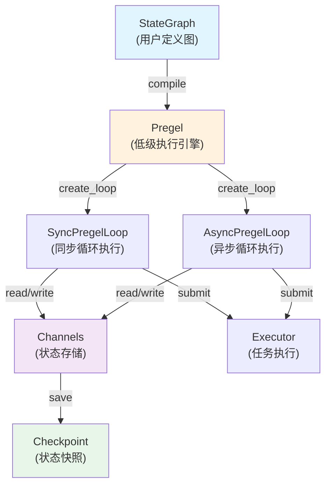
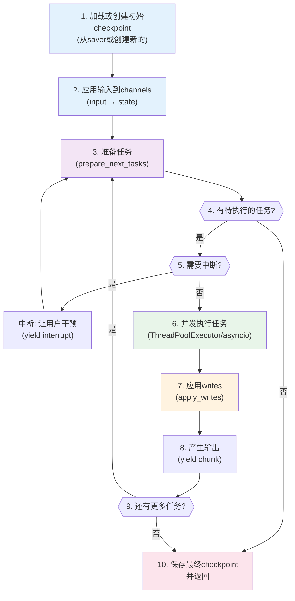
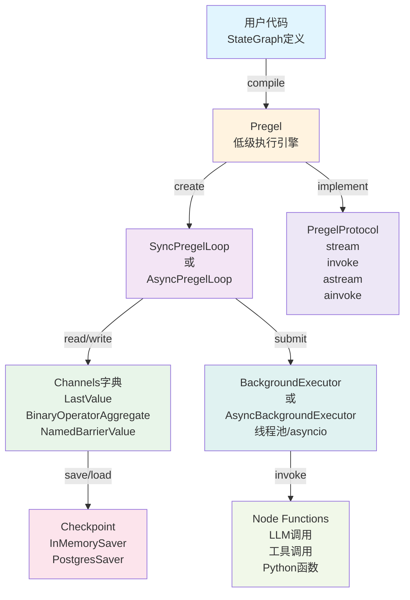
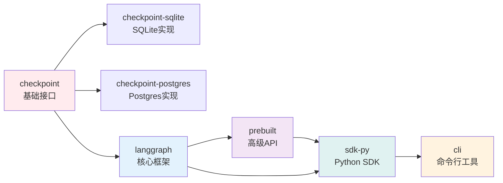
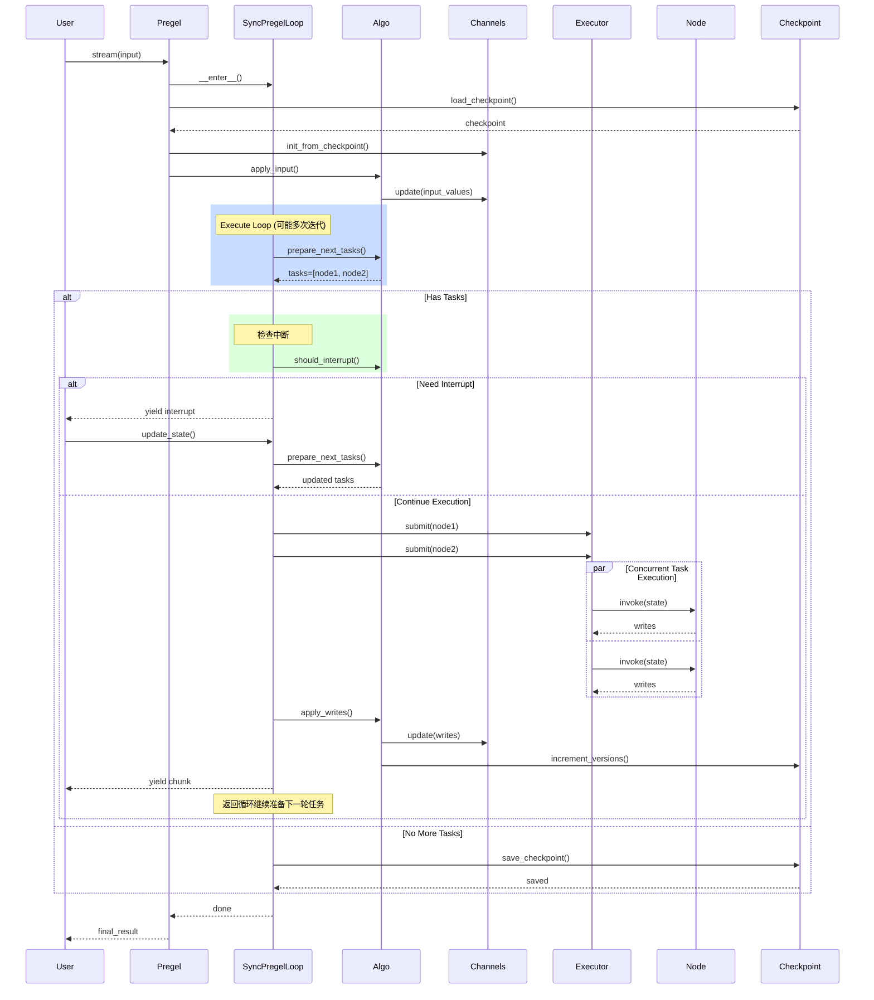
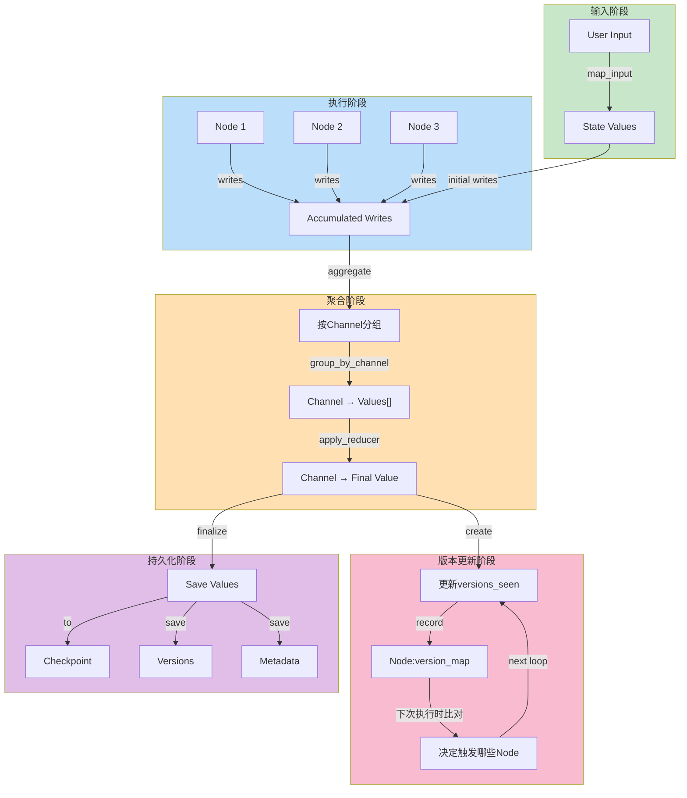
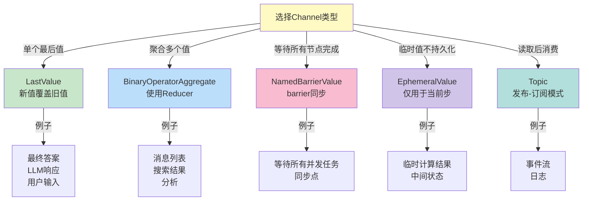

# LangGraph源码和架构个人学习和总结

LangGraph构建有状态多轮LLM应用的革命性框架

## 📋 目录

- [项目介绍](#项目介绍)
- [核心架构设计](#核心架构设计)
- [重点目录源码分析](#重点目录源码分析)
- [核心执行机制深度分析](#核心执行机制深度分析)
- [创新点](#创新点)
- [与其他框架的比较](#与其他框架的比较)
- [使用指南](#使用指南)
- [调试和常见问题解决](#调试和常见问题解决)
- [性能优化和扩展指南](#性能优化和扩展指南)
- [可视化架构图](#可视化架构图)
- [总结](#总结)

---

## 项目介绍

### 项目定义

LangGraph是一个由LangChain团队开发的**图计算框架**，专门用于构建**有状态、多角色的LLM应用**。它提供了一套完整的工具链，使开发者能够用图的方式定义和执行复杂的AI工作流。

**项目特点：**
- ✅ **有状态执行**：通过Checkpoint机制实现完整的状态持久化和恢复
- ✅ **多轮交互**：原生支持循环、条件分支、并发执行
- ✅ **工具调用**：集成LLM的function calling能力
- ✅ **人工干预**：支持中断点(interrupt)和状态更新
- ✅ **流式传输**：多种streaming mode支持实时输出
- ✅ **可观测性**：完整的追踪、日志和调试支持

### 版本信息

```plaintext
LangGraph版本: 1.0.7
Python支持: 3.10+
主要依赖:
  - langchain-core >= 0.1
  - langgraph-checkpoint >= 2.1.0
  - langgraph-prebuilt >= 1.0.7
  - pydantic >= 2.7.4
```

### 适用场景

1. **AI Agent系统**：构建自主智能体，具备循环决策和工具调用能力
2. **多轮对话系统**：实现复杂的对话流程、内存管理、上下文维护
3. **工作流自动化**：将复杂的多步骤业务流程表示为图，支持并发和条件判断
4. **检索增强生成(RAG)**：组合检索、排序、重排等多个步骤
5. **代码生成助手**：支持代码生成、验证、修复的多轮循环
6. **数据处理管道**：处理复杂的异构数据流，支持并发处理

---

## 核心架构设计

### 整体架构概览

LangGraph的核心思想是将**LLM应用的执行过程建模为一个有向无环图(DAG)**，其中：

- **节点(Node)**：代表执行单元，可以是LLM、工具、Python函数或子图
- **边(Edge)**：代表节点间的数据流和控制流
- **通道(Channel)**：节点间的通信媒介，存储共享状态
- **Checkpoint**：状态快照，支持持久化和恢复

### 分层架构

```
┌─────────────────────────────────────────────────────——┐
│         高层API (High-Level APIs)                      │
│  StateGraph | CompiledStateGraph | create_react_agent ｜
└────────────┬────────────────────────────────────────——┘
             │
┌─────────────┴──────────────────────────────────────—————┐
│      核心引擎层 (Core Engine Layer)                       │
│  Pregel | PregelLoop | SyncPregelLoop | AsyncPregelLoop ｜ 
└────────────┬────────────────────────────────────────----┘
             │
┌─────────────┴─────────────────────────────────────——┐
│       算法层 (Algorithm Layer)                       │
│  _algo.py: apply_writes | prepare_next_tasks        │
│           local_read | should_interrupt             │
└────────────┬────────────────────────────────────────┘
             │
┌────────────┴────────────────────────────────——──────┐
│      基础设施层 (Infrastructure Layer)                │
│  Channels | Checkpoints | Store | Runtime           │
└─────────────────────────────────────────────────────┘
```

### 关键组件交互



---

## 重点目录源码分析

### 1. `/libs/langgraph/langgraph/graph/` - 图定义和编译

#### 核心模块：StateGraph & CompiledStateGraph

**文件：** [state.py](./libs/langgraph/langgraph/graph/state.py)

**代码思想：**
- **声明式定义**：使用TypedDict定义状态schema，通过type hint和reducer函数实现类型安全
- **Reducer模式**：支持为状态的每个字段定义reducer函数，用于聚合来自多个节点的更新

**关键类：**

```python
class StateGraph(Generic[StateT, ContextT, InputT, OutputT]):
    """
    使用共享状态通信的图。节点通过读写公共状态进行交互。
    
    关键特性：
    1. 状态schema：定义图的数据结构
    2. Reducer函数：实现状态更新逻辑
    3. Context：运行时上下文，对所有节点可见
    """
    
    def add_node(self, key: str, action: Node) -> Self:
        """添加一个执行节点"""
        # 节点可以是函数、Runnable或子图
    
    def add_edge(self, start_key: str, end_key: str) -> Self:
        """添加边：start_key -> end_key"""
    
    def add_conditional_edges(
        self,
        source: str,
        path: Callable[[State], str]
    ) -> Self:
        """根据state条件化路由"""
    
    def set_entry_point(self, key: str) -> Self:
        """设置入口节点"""
    
    def set_finish_point(self, key: str) -> Self:
        """设置终点节点"""
    
    def compile(self) -> CompiledStateGraph:
        """编译为可执行的图"""
```

**源码逻辑流（简化）：**

```python
# 1. 节点收集和验证
def __init__(self, state_schema, context_schema):
    self.nodes: dict[str, StateNodeSpec] = {}
    self.edges: set[tuple[str, str]] = set()
    self.branches: dict[str, dict[str, BranchSpec]] = defaultdict(dict)
    self.channels: dict[str, BaseChannel] = {}

# 2. 节点添加时创建通道
def add_node(self, key: str, action: Node) -> Self:
    # 根据节点的输入/输出类型自动创建或绑定通道
    self.nodes[key] = StateNodeSpec(
        id=key,
        action=action,
        input=_get_node_input(action),  # 提取参数类型
        metadata={}
    )
    return self

# 3. 编译时生成Pregel
def compile(self) -> CompiledStateGraph:
    # 验证图的合法性
    validate_graph(self)
    
    # 构建通道映射
    channels = self._build_channels()
    
    # 创建Pregel执行引擎
    pregel = Pregel(
        nodes=self._get_pregel_nodes(channels),
        channels=channels,
        edges=self.edges,
        branches=self.branches,
        input_type=self.input_schema,
        output_type=self.output_schema,
    )
    
    return CompiledStateGraph(pregel)
```

**Reducer模式示例：**

```python
from typing_extensions import Annotated, TypedDict

def list_reducer(a: list, b: int) -> list:
    """将整数追加到列表"""
    return a + [b] if b is not None else a

class State(TypedDict):
    # 不带reducer：覆盖更新
    user_input: str
    
    # 带reducer：聚合更新
    messages: Annotated[list[str], list_reducer]
    actions: Annotated[list[dict], lambda a, b: a + [b]]

# 使用：
graph = StateGraph(state_schema=State)
graph.add_node("A", node_fn_a)  # 可以修改state["messages"]
graph.add_node("B", node_fn_b)  # 也可以修改state["messages"]
# 最终结果：两个节点的updates都被reducer聚合
```

#### 条件分支和动态路由

**核心概念：**

条件分支允许图在运行时根据状态内容动态决定下一步执行的节点。

```python
def route_decision(state: State) -> str:
    """根据状态决定路由"""
    if state.get("needs_search"):
        return "search_node"
    elif state.get("needs_generation"):
        return "generate_node"
    else:
        return "end"

graph.add_conditional_edges(
    source="decision_point",
    path=route_decision,
    # path_map参数（可选）：将返回值映射到节点名
)
```

**内部实现（在Pregel中）：**
1. 执行source节点
2. 调用path函数获取路由结果
3. 根据结果选择下一个要执行的节点

---

### 2. `/libs/langgraph/langgraph/pregel/` - 执行引擎核心

#### 2.1 主文件：main.py - Pregel类

**文件：** [main.py](./libs/langgraph/langgraph/pregel/main.py) (3300+ 行)

**Pregel类的职责：**
- 作为LangGraph的低级执行引擎
- 实现图的同步和异步执行
- 管理checkpoint和状态恢复
- 处理错误和中断

**核心方法：**

```python
class Pregel(PregelProtocol[StateT, ContextT, InputT, OutputT]):
    """
    有向无环图的执行引擎，支持：
    - 静态节点和动态子图
    - 状态共享和reducer聚合
    - Checkpoint持久化
    - 流式execution和中断
    """
    
    def __init__(
        self,
        nodes: Mapping[str, PregelNode],
        channels: Mapping[str, BaseChannel],
        edges: Iterable[tuple[str, str]] = (),
        branches: Mapping[str, Mapping[str, BranchSpec]] = {},
        input_type: Any = ...,
        output_type: Any = ...,
        state_schema: Any | None = None,
        checkpointer: BaseCheckpointSaver | None = None,
        interrupt_before: All | Sequence[str] | None = None,
        interrupt_after: All | Sequence[str] | None = None,
        auto_validate: bool = True,
    ):
        # 初始化执行引擎配置
        self.nodes = nodes
        self.channels = channels
        self.edges = edges
        self.branches = branches
        
        # checkpoint支持：默认无状态
        self.checkpointer = checkpointer
```

**执行流程（stream方法）：**

```python
def stream(
    self,
    input: InputT,
    config: RunnableConfig | None = None,
    *,
    stream_mode: StreamMode = "values",
    interrupt_before: All | Sequence[str] | None = None,
    interrupt_after: All | Sequence[str] | None = None,
) -> Iterator[StreamChunk]:
    """
    流式执行图，逐步输出中间结果
    
    参数：
        input: 初始输入
        config: 运行时配置（包含thread_id, checkpoint_id等）
        stream_mode: 输出模式
            - "values": 每步后的完整状态
            - "updates": 仅输出该步的更新
            - "debug": 详细的调试信息
            - "custom": 用户自定义的流
    
    执行步骤：
    1. 初始化或恢复checkpoint
    2. 创建loop执行器
    3. 逐步执行任务
    4. 应用writes到checkpoint
    5. 检查中断条件
    6. 产生流输出
    """
    loop = self._create_loop(config)  # 创建同步循环
    with loop:
        for chunk in loop.stream(
            input,
            config=config,
            stream_mode=stream_mode,
            interrupt_before=interrupt_before,
            interrupt_after=interrupt_after,
        ):
            yield chunk
```

---

#### 2.2 算法核心：_algo.py - 任务调度和状态管理

**文件：** [_algo.py](./libs/langgraph/langgraph/pregel/_algo.py) (1200+ 行)

**核心职责：**
- 任务准备和调度（prepare_next_tasks）
- 状态更新和应用（apply_writes）
- 本地状态读取（local_read）
- 中断判断（should_interrupt）

**关键算法 1：应用写入 (apply_writes)**

```python
def apply_writes(
    checkpoint: Checkpoint,
    channels: Mapping[str, BaseChannel],
    tasks: Iterable[WritesProtocol],
    get_next_version: GetNextVersion | None,
    trigger_to_nodes: Mapping[str, Sequence[str]],
) -> set[str]:
    """
    将任务的写入应用到checkpoint和channels
    
    核心逻辑：
    1. 按path排序任务（确保确定性）
    2. 更新版本见证(versions_seen)
    3. Consume已读取的通道
    4. 按通道分组写入
    5. 更新通道值
    6. 递增版本号
    
    返回：被更新的通道集合
    """
    
    # 步骤1：排序确保确定性顺序
    tasks = sorted(tasks, key=lambda t: task_path_str(t.path[:3]))
    
    # 步骤2：更新versions_seen
    for task in tasks:
        checkpoint["versions_seen"].setdefault(task.name, {}).update({
            chan: checkpoint["channel_versions"][chan]
            for chan in task.triggers
            if chan in checkpoint["channel_versions"]
        })
    
    # 步骤3：consume操作（用于BarrierChannel等）
    for chan in {
        chan for task in tasks 
        for chan in task.triggers
        if chan not in RESERVED and chan in channels
    }:
        if channels[chan].consume() and next_version is not None:
            checkpoint["channel_versions"][chan] = next_version
    
    # 步骤4-6：聚合并应用写入
    pending_writes_by_channel = defaultdict(list)
    for task in tasks:
        for chan, val in task.writes:
            if chan in channels:
                pending_writes_by_channel[chan].append(val)
    
    updated_channels = set()
    for chan, vals in pending_writes_by_channel.items():
        if channels[chan].update(vals):  # update返回是否实际更新了
            if next_version is not None:
                checkpoint["channel_versions"][chan] = next_version
            if channels[chan].is_available():
                updated_channels.add(chan)
    
    return updated_channels
```

**关键算法 2：准备下一步任务 (prepare_next_tasks)**

```python
def prepare_next_tasks(
    checkpoint: Checkpoint,
    channels: Mapping[str, BaseChannel],
    managed: ManagedValueMapping,
    starting: list[str],
    triggers_map: Mapping[str, Sequence[str]],
    *,
    for_execution: bool = True,
) -> deque[PregelExecutableTask]:
    """
    根据更新的通道，确定哪些节点应该被执行
    
    核心逻辑：
    1. 从starting节点开始
    2. 对于每个节点，检查其触发通道是否有新值
    3. 如果触发通道已被消费（versions_seen中有记录），跳过
    4. 否则，将节点加入执行队列
    
    这是LangGraph的关键调度策略
    """
    
    next_tasks: deque[PregelExecutableTask] = deque()
    remaining = deque(starting)
    processed = set()
    
    while remaining:
        node_name = remaining.popleft()
        if node_name in processed:
            continue
        processed.add(node_name)
        
        # 检查该节点是否应该被触发
        should_run = False
        for trigger_chan in triggers_map.get(node_name, []):
            # 如果通道有值且节点还没看过该版本
            if channels[trigger_chan].is_available():
                seen_version = checkpoint["versions_seen"].get(
                    node_name, {}
                ).get(trigger_chan)
                current_version = checkpoint["channel_versions"].get(trigger_chan)
                
                if current_version != seen_version:
                    should_run = True
                    break
        
        if should_run:
            task = prepare_single_task(
                checkpoint,
                channels,
                managed,
                node_name,
                triggers_map.get(node_name, []),
            )
            next_tasks.append(task)
            
            # 添加后续节点到待检查列表
            for chan in channels:
                for downstream_node in triggers_map.get(chan, []):
                    if downstream_node not in processed:
                        remaining.append(downstream_node)
    
    return next_tasks
```

**关键算法 3：本地读取 (local_read)**

```python
def local_read(
    scratchpad: PregelScratchpad,
    channels: Mapping[str, BaseChannel],
    managed: ManagedValueMapping,
    task: WritesProtocol,
    select: list[str] | str,
    fresh: bool = False,
) -> dict[str, Any] | Any:
    """
    用于条件分支中读取状态
    
    关键特性：
    - 如果fresh=True，应用该任务的writes后再读取
    - 否则，读取checkpoint中的值
    
    这允许条件分支根据当前节点的输出来决定路由
    """
    
    if fresh:
        # 创建该任务特定的本地通道视图
        local_channels = {}
        for k in channels:
            cc = channels[k].copy()
            # 只应用该任务的writes
            task_updates = defaultdict(list)
            for c, v in task.writes:
                if c == k:
                    task_updates[c].append(v)
            cc.update(task_updates[k])
            local_channels[k] = cc
        values = read_channels(local_channels, select)
    else:
        values = read_channels(channels, select)
    
    return values
```

---

#### 2.3 执行循环：_loop.py - 同步和异步执行

**文件：** [_loop.py](./libs/langgraph/langgraph/pregel/_loop.py) (1300+ 行)

**两个核心循环类：**

1. **SyncPregelLoop** - 同步执行循环

```python
class SyncPregelLoop(AbstractContextManager):
    """
    同步执行图的主循环
    
    关键特性：
    - 逐步执行任务
    - 支持并发任务（通过ThreadPoolExecutor）
    - 支持中断和恢复
    - 完整的checkpoint管理
    """
    
    def __enter__(self):
        self.executor = BackgroundExecutor(self.config)
        self.executor.__enter__()
        return self
    
    def stream(
        self,
        input: InputT,
        config: RunnableConfig,
        *,
        stream_mode: StreamMode = "values",
        interrupt_before: All | Sequence[str] | None = None,
        interrupt_after: All | Sequence[str] | None = None,
    ) -> Iterator[StreamChunk]:
        """
        核心流式执行方法
        
        执行步骤：
        1. 初始化或加载checkpoint
        2. 应用输入到初始通道
        3. 循环执行：
           a. 准备下一步任务
           b. 检查中断条件
           c. 执行任务
           d. 应用writes
           e. 产生流输出
        4. 保存最终checkpoint
        """
```

**执行循环的详细流程：**



2. **AsyncPregelLoop** - 异步执行循环

```python
class AsyncPregelLoop(AbstractAsyncContextManager):
    """
    异步执行图的主循环，与SyncPregelLoop对称
    
    关键差异：
    - 使用asyncio而不是threading
    - 支持并发await多个任务
    - 支持max_concurrency限制
    """
    
    async def astream(
        self,
        input: InputT,
        config: RunnableConfig,
        *,
        stream_mode: StreamMode = "values",
    ) -> AsyncIterator[StreamChunk]:
        # 类似stream，但是async/await版本
        pass
```

---

### 3. `/libs/langgraph/langgraph/channels/` - 状态存储机制

**文件：** [base.py](./libs/langgraph/langgraph/channels/base.py)

#### BaseChannel - 通道的抽象接口

```python
class BaseChannel(Generic[Value, Update, Checkpoint], ABC):
    """
    通道是节点之间的通信通道，存储和管理共享状态
    
    核心概念：
    - Value: 通道当前存储的值类型
    - Update: 通道可以接收的更新类型
    - Checkpoint: 通道用于持久化的类型
    
    关键特性：
    1. 懒加载：通道可以为空（EmptyChannelError）
    2. 版本控制：支持版本追踪（用于触发）
    3. Reducer模式：支持聚合多个更新
    4. 消费机制：update后可以consume（用于BarrierChannel）
    """
    
    @abstractmethod
    def get(self) -> Value:
        """获取当前值，如果为空抛出EmptyChannelError"""
    
    @abstractmethod
    def update(self, values: Sequence[Update]) -> bool:
        """
        用一个或多个更新值更新通道
        
        返回：
            True - 通道被实际更新了
            False - 通道值未改变
        """
    
    def consume(self) -> bool:
        """标记通道已被消费。某些通道可能会修改其状态。"""
    
    def checkpoint(self) -> Checkpoint | Any:
        """返回可序列化的状态快照"""
    
    @abstractmethod
    def from_checkpoint(self, checkpoint: Checkpoint) -> Self:
        """从checkpoint恢复通道状态"""
```

#### 内置通道实现

**1. LastValue - 始终覆盖的通道**

```python
class LastValue(BaseChannel[Value, Value, Value]):
    """
    存储最后一次更新的值，新的更新会覆盖旧的
    
    使用场景：
    - 用户输入
    - 决策结果
    - 简单的状态变量
    """
    
    def __init__(self, typ):
        self.typ = typ
        self.value = MISSING
    
    def update(self, values: Sequence[Value]) -> bool:
        if not values:
            return False
        
        # 取最后一个值，直接覆盖
        self.value = values[-1]
        return True
```

**2. BinaryOperatorAggregate - Reducer通道**

```python
class BinaryOperatorAggregate(BaseChannel[Value, Update, Value]):
    """
    使用reducer函数聚合多个更新值
    
    使用场景：
    - 从多个节点收集消息（通过reducer追加到列表）
    - 统计聚合（求和、求最大值等）
    - 自定义聚合逻辑
    
    工作原理：
    ```
    current = reducer(current, update1)
    current = reducer(current, update2)
    current = reducer(current, update3)
    ```
    """
    
    def __init__(self, typ, reducer, initial):
        self.typ = typ
        self.reducer = reducer
        self.value = initial
    
    def update(self, values: Sequence[Update]) -> bool:
        if not values:
            return False
        
        old_value = self.value
        for val in values:
            self.value = self.reducer(self.value, val)
        
        # 检查是否实际改变了值
        return self.value != old_value
```

**3. NamedBarrierValue - 等待屏障**

```python
class NamedBarrierValue(BaseChannel[dict, tuple[str, Value], dict]):
    """
    等待直到收到所有指定key的值
    
    使用场景：
    - 多个并发节点，需要等待所有都完成
    - 同步点（barrier）
    
    工作原理：
    1. 定义expected_keys = ["task1", "task2", "task3"]
    2. 逐个接收更新：("task1", value1), ("task2", value2), ...
    3. 直到收到所有keys，通道才变为available
    """
    
    def __init__(self, expected_keys: set[str]):
        self.expected_keys = expected_keys
        self.values = {}
    
    def is_available(self) -> bool:
        # 只有当收到所有expected_keys后才可用
        return all(k in self.values for k in self.expected_keys)
    
    def update(self, values: Sequence[tuple[str, Value]]) -> bool:
        for k, v in values:
            self.values[k] = v
        return True
```

---

### 4. `/libs/langgraph/langgraph/types.py` - 核心类型定义

**关键类型和类：**

```python
# 流模式定义
StreamMode = Literal[
    "values",        # 每步的完整状态
    "updates",       # 仅该步的更新
    "checkpoints",   # checkpoint变化
    "tasks",         # 执行的任务
    "debug",         # 调试信息
    "messages",      # LLM消息
    "custom"         # 自定义流
]

# 中断模式
All = Literal["*"]  # 中断所有节点

class Interrupt:
    """表示对图执行的中断，可以提供补充值"""
    value: Any

class Send:
    """在node中发送到其他节点的命令"""
    node: str  # 目标节点
    arg: Any   # 发送给节点的参数

class Command:
    """节点可以返回的命令（中断、发送、更新等）"""
    pass

class StateSnapshot:
    """图在某个时点的完整状态快照"""
    values: dict[str, Any]  # 当前状态值
    next: list[str]         # 下一步要执行的节点
    config: RunnableConfig  # 运行时配置
    metadata: dict          # 元数据（时间戳等）
```

---

## 核心执行机制深度分析

### 任务执行和版本控制的完整流程

LangGraph的精妙之处在于通过**版本化机制**实现了对循环图的精确控制。让我们深入分析其内部工作原理：

#### 版本控制机制详解

```python
# 在Checkpoint中维护的版本信息结构
Checkpoint = {
    "ts": datetime,
    "values": {
        "channel_name": value,
        ...
    },
    "channel_versions": {
        "input": 1,         # 每个channel都有独立版本
        "messages": 2,
        "output": 3,
    },
    "versions_seen": {
        "node_1": {"input": 1, "messages": 2},    # 节点看到的版本
        "node_2": {"input": 1, "messages": 1},    # 节点看到的版本
    },
    "pending_writes": [],   # 待应用的写入
}

# 核心逻辑：节点何时被触发？
# 答案：当节点的任何trigger_channel的版本 > versions_seen中记录的版本时
#
# 示例：
# Step 1: node_1执行，更新channel_versions["messages"] = 2
#         versions_seen["node_2"]["messages"] = 1 < 2 → node_2应该被触发
# 
# Step 2: node_2执行，读取消息版本2
#         versions_seen["node_2"]["messages"] = 2
#         即使messages再次更新为版本3，node_2仍会被触发（因为3 > 2）
#
# Step 3: 如果node_1再次更新messages为版本4
#         versions_seen["node_1"]["messages"] = 2 < 4 → node_1被再次触发
#         这就是"循环"的机制！
```

**这个设计的妙处：**

1. ✅ **避免重复执行**：节点记住自己看过的版本，不会重复处理相同的版本
2. ✅ **支持循环**：新的版本会重新触发节点，自然支持循环
3. ✅ **确定性执行**：版本号严格单调递增，保证执行顺序确定
4. ✅ **高效调度**：只比较版本号，比遍历整个状态快得多

#### 任务执行的完整流程（带示例）

```python
# 假设图结构：
#   input -> [process, validate] -> [combine] -> output
#            (并行执行)

# 初始化：
checkpoint = {
    "values": {"input": "hello", "messages": []},
    "channel_versions": {"input": 1, "messages": 1},
    "versions_seen": {
        "process": {},
        "validate": {},
        "combine": {},
    }
}

# Step 1: 从输入通道input出发
# prepare_next_tasks找到的节点：
#   - process (trigger="input", 未在versions_seen中)
#   - validate (trigger="input", 未在versions_seen中)
tasks = [
    PregelExecutableTask(name="process", ...),
    PregelExecutableTask(name="validate", ...)
]

# Step 2: 并行执行这两个任务
# process执行结果：{"messages": ["processed"]}
# validate执行结果：{"messages": ["validated"]}
writes = [
    ("process", [("messages", "processed")]),
    ("validate", [("messages", "validated")]),
]

# Step 3: 应用writes
# 关键：messages字段有reducer: lambda a,b: a+[b]
# 执行顺序（按path排序）：
#   current_messages = [] (初始)
#   current_messages = reducer([], "processed") = ["processed"]
#   current_messages = reducer(["processed"], "validated") = ["processed", "validated"]
#
# 更新versions：
#   channel_versions["messages"] = 2 (从1递增)
#
# 更新versions_seen：
#   versions_seen["process"]["input"] = 1
#   versions_seen["validate"]["input"] = 1

# Step 4: 检查下一步任务
# combine节点的trigger是messages，版本从1变为2
# versions_seen["combine"]["messages"] 不存在 or < 2
# → combine应该被执行
tasks = [
    PregelExecutableTask(name="combine", ...)
]

# Step 5: 执行combine，最终输出
```

#### Checkpoint恢复的关键细节

```python
# 假设中断：
# 1. graph在节点"process"中间中断
# 2. checkpoint被保存，包含versions_seen信息

# 恢复步骤：
restored_checkpoint = checkpointer.get(thread_id, checkpoint_id)
# → values已恢复
# → channel_versions已恢复 
# → versions_seen已恢复！（关键！）

# 继续执行：
# prepare_next_tasks会使用versions_seen来判断
# 因为versions_seen已正确记录，所以：
# - 已经执行过的节点不会重复执行
# - 新接收到的更新会正确触发节点
```

**这就是LangGraph为什么能支持完整的故障恢复的原因！**

### 条件分支的底层实现

```python
# 用户代码：
def route_to_next(state: State) -> str:
    if state["needs_llm"]:
        return "llm_node"
    else:
        return "process_node"

graph.add_conditional_edges(
    source="decision",
    path=route_to_next
)

# LangGraph内部实现：
# 1. 执行decision节点，产生writes
# 2. 应用writes到channels
# 3. 调用route_to_next(state)获得下一个节点名
# 4. 基于返回值，将对应的边添加到执行计划

# 关键点：route函数可以读取"fresh"状态
# 即：decision节点的输出立即用于决策，不需要等待版本更新
```

---

## 创新点

### 1. **有向无环图 + Reducer模式的融合**

LangGraph的最大创新在于**将状态图编程与函数式编程的reducer模式结合**：

- **传统多轮系统**：消息列表通常是局部管理的，每轮交互需要手动维护
- **LangGraph**：通过`Annotated[list, list_reducer]`这样的声明，自动处理来自多个并发节点的消息聚合

```python
# 声明式定义reducer
class State(TypedDict):
    messages: Annotated[list[str], lambda a, b: a + [b] if b else a]

# 这样，两个并发节点可以同时修改messages，自动聚合
graph.add_node("generate_answer", generate_node)
graph.add_node("retrieve_docs", retrieve_node)
graph.add_edge("generate_answer", "merge")  # 都汇聚到merge
```

**优势**：
- ✅ 类型安全（Pydantic验证）
- ✅ 高并发友好（Reducer自动聚合）
- ✅ 声明式清晰

### 2. **版本化的任务触发机制**

LangGraph引入了**Channel Versioning**，实现精细的任务触发：

```python
# 核心思想：每个channel有version
checkpoint["channel_versions"] = {
    "user_input": Version(5),
    "search_results": Version(3),
    "llm_response": Version(7),
}

# 节点在上次执行后看到的version
checkpoint["versions_seen"] = {
    "search_node": {
        "user_input": Version(5),  # 上次看到5
    }
}

# 决定是否触发：
if channel.current_version > node.seen_version:
    # 通道有新值，触发该节点
    schedule_node_for_execution()
```

**这解决了一个经典问题**：在循环系统中，如何避免节点重复执行？

- ❌ 简单方案：记录每个节点执行过 → 无法处理循环
- ✅ LangGraph：记录每个节点看过的版本 → 可以处理循环，且高效

### 3. **完整的State Checkpoint和恢复机制**

LangGraph的Checkpoint不仅保存状态值，还保存：

```python
Checkpoint = {
    "ts": datetime,                # 时间戳
    "values": dict,                # 所有channel的值
    "channel_versions": dict,      # 每个channel的版本
    "versions_seen": dict,         # 每个节点的versions_seen
    "pending_writes": list,        # 未应用的写入
    "metadata": dict,              # 用户元数据
}
```

**恢复时的魔法**：

```python
# 假设graph在某个节点中断了
checkpoint = saver.get(thread_id, checkpoint_id)

# 1. 恢复所有channels到该状态
channels = channels_from_checkpoint(checkpoint)

# 2. versions_seen会让只有新接收到更新的节点被触发
# 3. pending_writes会被应用
# 4. 图继续执行，就像没有中断过一样

# 用户可以：
# - 检查当前状态：compiled_graph.get_state(config)
# - 编辑状态后继续：compiled_graph.update_state(config, {"key": new_value})
# - 看到完整历史：compiled_graph.get_state_history(config)
```

### 4. **灵活的中断机制（Human-in-the-loop）**

通过`interrupt_before`和`interrupt_after`参数，实现精细的执行控制：

```python
# 在LLM节点之前中断，让用户审查输入
compiled_graph.stream(
    input,
    config,
    interrupt_before=["llm_node"]
)

# 在工具调用后中断，让用户审查结果
compiled_graph.stream(
    input,
    config,
    interrupt_after=["tool_node"]
)

# 用户审查后，继续执行
config = compiled_graph.update_state(config, {"approved": True})
for chunk in compiled_graph.stream(None, config):
    print(chunk)
```

**实现原理**（在_algo.py中）：

```python
def should_interrupt(
    checkpoint: Checkpoint,
    interrupt_nodes: All | Sequence[str],
    tasks: list[PregelExecutableTask],
) -> list[PregelExecutableTask]:
    """
    检查是否应该中断
    
    关键：比较当前versions和上次interrupt后的versions
    - 如果有新的channel版本，说明有新的变化
    - 如果有要执行的任务在interrupt_nodes中，则中断
    """
    
    # 找到上次interrupt时的versions
    seen = checkpoint["versions_seen"].get(INTERRUPT, {})
    
    # 检查是否有新的channel更新
    any_new_updates = any(
        v > seen.get(c)
        for c, v in checkpoint["channel_versions"].items()
    )
    
    # 如果有新更新，且有任务在interrupt列表中
    return [
        t for t in tasks
        if any_new_updates and (
            interrupt_nodes == "*" or t.name in interrupt_nodes
        )
    ]
```

### 5. **多种流式输出模式**

LangGraph提供7种流模式，满足不同需求：

```python
# 1. "values" - 每步后的完整状态
for chunk in graph.stream(input, stream_mode="values"):
    print(chunk)  # {"state_key": value, ...}

# 2. "updates" - 仅该步的更新
for chunk in graph.stream(input, stream_mode="updates"):
    print(chunk)  # {"node_name": {"key": value}}

# 3. "debug" - 详细的调试信息
for chunk in graph.stream(input, stream_mode="debug"):
    print(chunk)  # 包括执行时间、堆栈等

# 4. "messages" - LLM消息流
for chunk in graph.stream(input, stream_mode="messages"):
    print(chunk)  # {"source": node, "message": ...}

# 5. "custom" - 用户自定义流
# 节点内部使用：
def node(state):
    writer = config[CONF][CONFIG_KEY_STREAM]
    writer(("node_name", "custom_tag", {"data": "value"}))
```

### 6. **完整的异步支持**

区别于简单的async/await包装，LangGraph从底层架构就支持异步：

```python
# AsyncPregelLoop使用asyncio任务而非线程
async def astream(...):
    async with AsyncPregelLoop(...) as loop:
        async for chunk in loop.astream(...):
            yield chunk

# 支持max_concurrency限制，避免资源溢出
config = {"max_concurrency": 5}
async for chunk in graph.astream(input, config={"configurable": config}):
    pass
```

### 7. **子图和模块化**

LangGraph支持将图组合成子图，实现真正的模块化：

```python
# 子图的关键特性：
# 1. 可以有自己的state schema和checkpointer
# 2. 可以transform输入/输出
# 3. 支持嵌套（子图中的子图）

subgraph = StateGraph(SubState)
subgraph.add_node("process", process_node)
subgraph.set_entry_point("process")
subgraph.set_finish_point("process")

main_graph = StateGraph(MainState)
main_graph.add_node("subgraph", subgraph.compile())
```

---

## 与其他框架的比较

### LangGraph vs 传统编程范式

| 特性 | 传统多轮系统 | LangGraph |
|------|------------|----------|
| **状态管理** | 手动维护消息列表、上下文 | 声明式State schema + Reducer自动聚合 |
| **控制流** | if/while循环嵌套 | 图的边和条件分支清晰直观 |
| **并发处理** | 复杂的线程/异步管理 | 内置并发执行，自动依赖管理 |
| **故障恢复** | 手动save/restore逻辑 | Checkpoint自动化，支持中断恢复 |
| **人工干预** | 需要自己实现中断点 | 原生支持interrupt_before/after |
| **代码行数** | 50-100行 | 10-20行 |
| **可维护性** | 低（逻辑分散） | 高（图结构清晰） |

### LangGraph vs 其他Agent框架

| 框架 | 优势 | 劣势 |
|------|------|------|
| **LangGraph** | ✅ 完整的状态管理<br/>✅ 精细的execution控制<br/>✅ 原生中断和恢复 | 学习曲线稍陡 |
| **AutoGen** | ✅ 多Agent协作<br/>✅ 易于上手 | ❌ 状态管理较弱<br/>❌ 中断恢复支持不足 |
| **LangChain** | ✅ 生态完整<br/>✅ 工具集丰富 | ❌ 工作流控制弱<br/>❌ 状态管理简陋 |
| **Semantic Kernel** | ✅ 企业支持<br/>✅ .NET生态 | ❌ 不支持Python良好<br/>❌ 开源社区小 |

### 学习曲线和优化建议

**快速学习路径：**

1. **第1步（1-2天）**：理解StateGraph的基本概念
   - TypedDict定义state schema
   - add_node和add_edge的基本使用
   - compile和invoke简单流程

2. **第2步（3-5天）**：深入条件分支和reducer
   - 条件分支的path函数
   - Reducer模式处理多节点更新
   - 测试并发执行

3. **第3步（1周）**：掌握checkpoint和中断
   - 使用Checkpointer保存状态
   - interrupt_before/after的使用
   - update_state的恢复流程

4. **第4步（2周）**：优化和扩展
   - 自定义Channel类型
   - Subgraph的模块化设计
   - 性能优化（流式传输、异步）

**性能优化建议：**

```python
# 1. 使用async避免阻塞
async for chunk in graph.astream(input):
    process(chunk)

# 2. 流式处理而不是等待完整结果
for chunk in graph.stream(input, stream_mode="updates"):
    # 可以实时处理，而不是等待整个图完成

# 3. 合理使用checkpoint保存粒度
compiled = graph.compile(
    checkpointer=checkpointer,
    durability="async"  # 异步持久化，不阻塞执行
)

# 4. 使用max_concurrency限制资源
config = {"configurable": {"max_concurrency": 5}}
for chunk in graph.stream(input, config={"configurable": config}):
    pass
```

---

## 使用指南

### 快速开始

#### 1. 基础状态图

```python
from typing_extensions import Annotated, TypedDict
from langgraph.graph import StateGraph
from langgraph.checkpoint.memory import InMemorySaver

# 定义状态schema
class AgentState(TypedDict):
    query: str              # 用户查询
    messages: Annotated[
        list[str],
        lambda a, b: a + [b] if b else a  # 消息reducer
    ]
    response: str           # 最终响应

# 定义节点函数
def llm_node(state: AgentState) -> dict:
    """调用LLM"""
    # 基于state["query"]和state["messages"]生成响应
    response = call_llm(state["query"], state["messages"])
    return {"messages": response, "response": response}

def process_node(state: AgentState) -> dict:
    """处理LLM响应"""
    processed = process_response(state["response"])
    return {"response": processed}

# 构建图
graph = StateGraph(AgentState)
graph.add_node("llm", llm_node)
graph.add_node("process", process_node)

# 添加边
graph.add_edge("llm", "process")
graph.set_entry_point("llm")
graph.set_finish_point("process")

# 编译
checkpointer = InMemorySaver()  # 使用内存保存checkpoint
compiled = graph.compile(checkpointer=checkpointer)

# 执行
result = compiled.invoke({
    "query": "What is LangGraph?",
    "messages": [],
    "response": ""
})

print(result)
```

#### 2. 条件分支和循环

```python
class State(TypedDict):
    question: str
    search_count: int
    search_results: list[str]
    answer: str

def should_search(state: State) -> str:
    """决定是否需要搜索"""
    if state["search_count"] >= 3:
        return "generate_answer"
    return "search"

def search_node(state: State) -> dict:
    """执行搜索"""
    results = search_api(state["question"])
    return {
        "search_results": results,
        "search_count": state["search_count"] + 1
    }

def generate_node(state: State) -> dict:
    """生成最终答案"""
    answer = llm_generate(state["question"], state["search_results"])
    return {"answer": answer}

# 构建图
graph = StateGraph(State)
graph.add_node("search", search_node)
graph.add_node("generate", generate_node)

# 添加条件分支
graph.add_conditional_edges(
    source="search",
    path=should_search,
)

# 添加回环
graph.add_edge("search", "search")  # 可以循环搜索
graph.add_edge("generate", "__end__")

graph.set_entry_point("search")
compiled = graph.compile()

# 执行
result = compiled.invoke({
    "question": "What is AI?",
    "search_count": 0,
    "search_results": [],
    "answer": ""
})
```

#### 3. 流式执行和中断

```python
# 流式执行 - 实时获取中间结果
for chunk in compiled.stream(
    {"query": "..."},
    stream_mode="updates"
):
    node_name, updates = chunk
    print(f"{node_name}: {updates}")

# 带中断的执行 - 用于人工审核
config = {"configurable": {"thread_id": "user_123"}}

# 在审核节点前中断
for chunk in compiled.stream(
    {"query": "..."},
    config=config,
    interrupt_before=["review"]
):
    print(chunk)

# 获取当前状态
state = compiled.get_state(config)
print(f"Current state: {state.values}")
print(f"Next nodes: {state.next}")

# 用户审核和更新
compiled.update_state(
    config,
    {"approved": True, "reviewer_comment": "Looks good"}
)

# 继续执行
for chunk in compiled.stream(None, config):
    print(chunk)
```

### 常见Pattern

#### Pattern 1：Agent + 工具调用

```python
from langchain_core.tools import tool

@tool
def search(query: str) -> str:
    """搜索网络"""
    return search_api(query)

@tool
def calculator(expression: str) -> str:
    """计算表达式"""
    return str(eval(expression))

tools = [search, calculator]

def agent_node(state: State) -> dict:
    """Agent决策和工具调用"""
    messages = state["messages"]
    
    # 调用LLM
    response = llm.invoke(messages, tools=tools)
    
    if response.tool_calls:
        # 处理工具调用
        tool_results = []
        for tool_call in response.tool_calls:
            tool_name = tool_call["name"]
            tool_input = tool_call["args"]
            
            if tool_name == "search":
                result = search(tool_input["query"])
            elif tool_name == "calculator":
                result = calculator(tool_input["expression"])
            
            tool_results.append({
                "tool": tool_name,
                "result": result
            })
        
        return {"messages": messages + [response] + tool_results}
    else:
        # 返回最终答案
        return {"messages": messages + [response], "final_answer": response.content}

# 构建agent图
graph = StateGraph(State)
graph.add_node("agent", agent_node)
graph.set_entry_point("agent")
graph.set_finish_point("agent")

compiled = graph.compile()
```

#### Pattern 2：RAG Pipeline

```python
class RAGState(TypedDict):
    question: str
    documents: Annotated[list[str], lambda a, b: a + [b]]
    context: str
    answer: str

def retrieve_node(state: RAGState) -> dict:
    """检索相关文档"""
    docs = retriever.invoke(state["question"])
    return {"documents": [d.page_content for d in docs]}

def rerank_node(state: RAGState) -> dict:
    """重排文档"""
    reranked = reranker.rank(
        state["question"],
        state["documents"]
    )
    return {"documents": reranked}

def generate_node(state: RAGState) -> dict:
    """基于文档生成答案"""
    context = "\n".join(state["documents"][:3])
    prompt = f"Question: {state['question']}\n\nContext: {context}"
    answer = llm.invoke(prompt)
    return {"answer": answer}

# 构建RAG图
graph = StateGraph(RAGState)
graph.add_node("retrieve", retrieve_node)
graph.add_node("rerank", rerank_node)
graph.add_node("generate", generate_node)

graph.add_edge("retrieve", "rerank")
graph.add_edge("rerank", "generate")
graph.set_entry_point("retrieve")
graph.set_finish_point("generate")

compiled = graph.compile()
```

#### Pattern 3：并发执行和汇聚

```python
class ParallelState(TypedDict):
    question: str
    plan: str
    # 使用Annotated + reducer来自动聚合来自多个节点的结果
    analyses: Annotated[
        list[dict],
        lambda a, b: a + [b] if b else a
    ]
    summary: str

def planner_node(state: ParallelState) -> dict:
    """制定分析计划"""
    plan = llm.invoke(f"Plan analysis for: {state['question']}")
    return {"plan": plan}

def analysis_1(state: ParallelState) -> dict:
    """分析视角1"""
    result = llm.invoke(f"Analyze from perspective 1: {state['plan']}")
    return {"analyses": {"perspective": 1, "analysis": result}}

def analysis_2(state: ParallelState) -> dict:
    """分析视角2"""
    result = llm.invoke(f"Analyze from perspective 2: {state['plan']}")
    return {"analyses": {"perspective": 2, "analysis": result}}

def synthesis_node(state: ParallelState) -> dict:
    """综合所有分析"""
    all_analyses = "\n".join(str(a) for a in state["analyses"])
    summary = llm.invoke(f"Synthesize: {all_analyses}")
    return {"summary": summary}

# 构建并发图
graph = StateGraph(ParallelState)
graph.add_node("planner", planner_node)
graph.add_node("analysis_1", analysis_1)
graph.add_node("analysis_2", analysis_2)
graph.add_node("synthesis", synthesis_node)

# planner后并发执行两个分析
graph.add_edge("planner", "analysis_1")
graph.add_edge("planner", "analysis_2")

# 两个分析都汇聚到synthesis
graph.add_edge("analysis_1", "synthesis")
graph.add_edge("analysis_2", "synthesis")

graph.set_entry_point("planner")
graph.set_finish_point("synthesis")

compiled = graph.compile()

# 执行 - 两个分析会并发运行
result = compiled.invoke({"question": "..."})
print(result["summary"])
```

### 最佳实践

#### 1. **使用Annotated定义reducer**

```python
# ✅ 好的做法
class State(TypedDict):
    messages: Annotated[
        list[str],
        lambda a, b: a + [b] if b is not None else a
    ]

# ❌ 避免：直接覆盖
class BadState(TypedDict):
    messages: list[str]  # 只能被最后的节点覆盖
```

#### 2. **使用TypedDict而不是dataclass**

```python
# ✅ 推荐 - LangGraph原生支持，类型检查更好
from typing_extensions import TypedDict, Annotated
class State(TypedDict):
    query: str
    results: list[str]

# ❌ 避免 - 需要额外配置
from dataclasses import dataclass
@dataclass
class State:
    query: str
    results: list[str]
```

#### 3. **为节点添加重试和超时**

```python
from langgraph.types import RetryPolicy

def my_node(state):
    # 可能失败的操作
    return llm.invoke(state["query"])

# 添加重试策略
retry_policy = RetryPolicy(
    max_attempts=3,
    backoff_factor=2,
    base_delay=1.0
)

graph.add_node(
    "my_node",
    my_node,
    retry_policy=retry_policy
)
```

#### 4. **使用streaming处理长时间运行的任务**

```python
# ✅ 流式处理 - 实时获得反馈
for chunk in graph.stream(
    input_data,
    stream_mode="updates"
):
    print(f"Node: {chunk[0]}, Update: {chunk[1]}")
    # 可以实时显示进度给用户

# ❌ 避免：阻塞调用
result = graph.invoke(input_data)  # 需要等待整个图完成
```

#### 5. **使用Context传递不变数据**

```python
# 对于需要在所有节点共享但不更新的数据（如数据库连接、配置）
from langgraph.runtime import Runtime

class Context(TypedDict):
    db_connection: Any
    config: dict

graph = StateGraph(
    state_schema=State,
    context_schema=Context
)

def node_with_context(state: State, runtime: Runtime[Context]) -> dict:
    db = runtime.context["db_connection"]
    config = runtime.context["config"]
    # 使用db和config
    return {"result": ...}

# 执行时传递context
compiled.invoke(
    state,
    context={"db_connection": db, "config": config}
)
```

---

## 调试和常见问题解决

### 常见错误和解决方案

#### 问题 1：节点没有被执行

**症状：** 定义了节点，但图执行时节点没有运行

**常见原因和解决：**

```python
# ❌ 错误1：节点的trigger通道没有被更新
graph.add_node("process", process_node)
# 忘记添加边！
# ✅ 应该：
graph.add_edge("previous_node", "process")

# ❌ 错误2：节点读取的通道为空
def process_node(state):
    return {"result": state["input"]}  # input可能为空

# ✅ 检查方式：
# 在调用节点前检查输入是否可用
for chunk in graph.stream(input, stream_mode="debug"):
    # 查看debug输出，确认状态值

# ❌ 错误3：条件分支错误返回节点名
def route(state):
    return "nonexistent_node"  # 这个节点不存在！

# ✅ 验证节点存在：
print(graph.nodes.keys())  # 检查已定义的节点
```

#### 问题 2：状态更新未按预期进行

**症状：** 节点返回了数据，但状态没有更新

**常见原因和解决：**

```python
# ❌ 错误1：返回了不正确的格式
def my_node(state):
    return {"input": "value"}  # 可能该字段没有在schema中定义

# ✅ 检查state schema中的字段名
class State(TypedDict):
    my_field: str
    results: list[str]

# ❌ 错误2：Reducer未正确处理None值
class State(TypedDict):
    messages: Annotated[
        list[str],
        lambda a, b: a + [b]  # 如果b是None会失败！
    ]

# ✅ 正确的reducer：
class State(TypedDict):
    messages: Annotated[
        list[str],
        lambda a, b: a + [b] if b is not None else a
    ]

# ❌ 错误3：并发更新导致版本混乱
# 如果两个节点同时修改同一个non-reducer字段
# 最后执行的会覆盖前面的

# ✅ 解决方案：
# 对需要多节点修改的字段使用reducer：
class State(TypedDict):
    results: Annotated[list, lambda a, b: a + [b]]  # 聚合！
```

#### 问题 3：中断和恢复不工作

**症状：** 设置了interrupt_before但图没有中断

**常见原因和解决：**

```python
# ❌ 错误1：没有设置checkpointer
compiled = graph.compile()  # 没有checkpoint支持

# ✅ 正确做法：
from langgraph.checkpoint.memory import InMemorySaver
checkpointer = InMemorySaver()
compiled = graph.compile(checkpointer=checkpointer)

# ❌ 错误2：使用了hidden节点
# LangGraph自动跳过标记为hidden的节点
# 这意味着即使指定interrupt_before=["hidden_node"]也不会中断

# ✅ 检查节点是否有隐藏标记：
for chunk in compiled.stream(
    input,
    interrupt_before=["my_node"]
):
    print(chunk)  # 如果没有中断，检查节点配置

# ❌ 错误3：中断后没有正确继续执行
config = {"configurable": {"thread_id": "user_1"}}
for chunk in compiled.stream(input, config=config, interrupt_before=["review"]):
    print(chunk)

# 中断后需要重新调用stream，传入相同的config
for chunk in compiled.stream(None, config=config):  # 继续执行
    print(chunk)
```

### 调试技巧

#### 1. 使用debug stream mode

```python
# 打印详细的执行信息
for chunk in graph.stream(
    input,
    stream_mode="debug"
):
    print(chunk)
    # 输出格式：
    # {
    #   "type": "task_start" | "task_end",
    #   "node": "node_name",
    #   "timestamp": ...,
    #   "input": ...,
    #   "output": ...,
    #   "duration": ...
    # }
```

#### 2. 获取和检查状态快照

```python
# 在执行中获取当前状态
config = {"configurable": {"thread_id": "user_1"}}

# 执行一部分
for chunk in graph.stream(input, config=config, interrupt_before=["node_2"]):
    pass

# 获取当前状态
state = graph.get_state(config)
print(f"Current values: {state.values}")
print(f"Next nodes to run: {state.next}")

# 查看历史
for snapshot in graph.get_state_history(config, limit=5):
    print(f"Step: {snapshot.config['configurable']}")
    print(f"Values: {snapshot.values}")
```

#### 3. 添加日志和追踪

```python
import logging
from langchain_core.callbacks import LogCallbackHandler

logging.basicConfig(level=logging.DEBUG)

# 使用回调追踪执行
handler = LogCallbackHandler()

config = {
    "callbacks": [handler],
    "configurable": {"thread_id": "debug_run"}
}

result = graph.invoke(input, config=config)
# 会打印详细的LLM调用信息
```

#### 4. 验证图的结构

```python
# 获取图的可视化
graph.get_graph().draw_mermaid_dark()  # 生成mermaid图

# 检查所有节点
print(graph.nodes.keys())

# 检查所有边
print(graph.edges)

# 检查条件分支
print(graph.branches)

# 验证state schema
from langgraph.graph import StateGraph
# 查看自动生成的channels
compiled = graph.compile()
print(compiled.channels)
```

---

## 可视化架构图

### 系统整体架构



### 模块依赖关系



### 执行流程时序图



### 数据流动示意图



### Channel类型决策树



---

## 性能优化和扩展指南

### 性能优化建议

#### 1. 并发度控制

```python
# 限制并发任务数量，避免资源溢出
config = {
    "configurable": {
        "max_concurrency": 5  # 最多5个并发任务
    }
}

for chunk in graph.stream(input, config=config):
    process(chunk)

# 对于I/O密集型（API调用），可以增大：
config = {"configurable": {"max_concurrency": 20}}

# 对于CPU密集型，应该等于CPU核心数：
import multiprocessing
config = {"configurable": {"max_concurrency": multiprocessing.cpu_count()}}
```

#### 2. Checkpoint持久化策略

```python
# 选择合适的durability模式
compiled = graph.compile(
    checkpointer=checkpointer,
    durability="sync"  # 同步保存，每步后立即持久化（最安全，最慢）
)

compiled = graph.compile(
    checkpointer=checkpointer,
    durability="async"  # 异步保存，不阻塞执行（平衡方案）
)

compiled = graph.compile(
    checkpointer=checkpointer,
    durability="exit"  # 只在图退出时保存（最快，风险最高）
)

# 建议：生产环境使用"async"
```

#### 3. 流式处理 vs 批处理

```python
# ✅ 流式处理：实时获得结果，更快的用户反馈
def process_streaming(graph, input_list):
    for item in input_list:
        for chunk in graph.stream(item, stream_mode="updates"):
            # 立即处理中间结果
            handle_chunk(chunk)

# ❌ 批处理：等待所有结果，可能很慢
def process_batch(graph, input_list):
    results = []
    for item in input_list:
        result = graph.invoke(item)  # 阻塞调用
        results.append(result)
    return results

# 性能对比：
# 批处理：需要max(各项时间)
# 流处理：可以边处理边输出，感觉更快
```

#### 4. 缓存和重用

```python
# 使用RunnableConfig的cache功能
from langgraph.pregel._read import ChannelRead

# 对于重复调用相同输入的节点，启用缓存
def expensive_node(state):
    # 这个操作很昂贵
    return {"result": expensive_computation(state["query"])}

# 添加缓存策略
from langgraph.types import CachePolicy

graph.add_node(
    "expensive",
    expensive_node,
    cache_policy=CachePolicy(
        max_size=100,  # 缓存最多100条
        ttl=3600  # 1小时过期
    )
)
```

#### 5. 内存管理

```python
# 定期清理Checkpoint，避免数据库膨胀
def cleanup_old_checkpoints(checkpointer, thread_id, days=30):
    """删除超过N天的checkpoint"""
    from datetime import datetime, timedelta
    
    cutoff = datetime.now() - timedelta(days=days)
    
    # 获取所有checkpoint
    for snapshot in checkpointer.list(thread_id=thread_id):
        if snapshot.metadata.get("ts") < cutoff:
            checkpointer.delete(snapshot.config)

# 定期运行清理
import schedule
schedule.every().day.at("02:00").do(
    cleanup_old_checkpoints,
    checkpointer,
    thread_id="*",
    days=30
)
```

### 自定义扩展

#### 1. 自定义Channel实现

```python
from langgraph.channels.base import BaseChannel
from typing import Sequence, Any

class CustomChannel(BaseChannel):
    """自定义通道，存储最大N个值"""
    
    def __init__(self, typ, max_size=10):
        self.typ = typ
        self.max_size = max_size
        self.values = []
    
    @property
    def ValueType(self):
        return list
    
    @property
    def UpdateType(self):
        return Any
    
    def get(self):
        return self.values
    
    def update(self, values: Sequence[Any]) -> bool:
        if not values:
            return False
        
        self.values.extend(values)
        # 保持最多max_size个值
        if len(self.values) > self.max_size:
            self.values = self.values[-self.max_size:]
        
        return True
    
    def from_checkpoint(self, checkpoint):
        new_channel = self.__class__(self.typ, self.max_size)
        new_channel.values = checkpoint if checkpoint else []
        return new_channel
    
    def checkpoint(self):
        return self.values

# 使用自定义通道
from langgraph.pregel import Pregel

pregel = Pregel(
    nodes=...,
    channels={
        "history": CustomChannel(list, max_size=20),
        ...
    }
)
```

#### 2. 自定义Checkpointer

```python
from langgraph.checkpoint.base import BaseCheckpointSaver, CheckpointTuple

class RedisCheckpointer(BaseCheckpointSaver):
    """使用Redis存储checkpoint的实现"""
    
    def __init__(self, redis_client):
        self.client = redis_client
    
    def put(self, config, checkpoint, metadata=None):
        """保存checkpoint到Redis"""
        key = f"checkpoint:{config['configurable']['thread_id']}"
        import json
        self.client.set(
            key,
            json.dumps({
                "checkpoint": checkpoint,
                "metadata": metadata
            }),
            ex=86400  # 24小时过期
        )
    
    def get(self, config):
        """从Redis加载checkpoint"""
        key = f"checkpoint:{config['configurable']['thread_id']}"
        import json
        data = self.client.get(key)
        if not data:
            return None
        
        parsed = json.loads(data)
        return CheckpointTuple(
            checkpoint=parsed["checkpoint"],
            metadata=parsed["metadata"]
        )
    
    def list(self, config, **kwargs):
        """列出所有checkpoint"""
        pattern = f"checkpoint:{config['configurable']['thread_id']}:*"
        keys = self.client.keys(pattern)
        # 返回checkpoint列表...
```

#### 3. 自定义Node类型

```python
from langgraph.pregel._read import PregelNode
from typing import Callable, Any

class TransformNode:
    """转换型节点，用于数据转换而不是业务逻辑"""
    
    def __init__(self, transform_fn: Callable[[Any], Any]):
        self.transform_fn = transform_fn
    
    def __call__(self, state):
        # 遍历所有状态字段，应用转换
        return {
            k: self.transform_fn(v)
            for k, v in state.items()
        }

# 使用示例
def uppercase_transform(value):
    return value.upper() if isinstance(value, str) else value

graph.add_node(
    "uppercase_all",
    TransformNode(uppercase_transform)
)
```

#### 4. 自定义Stream模式

```python
# 为自定义处理定义stream callback
def my_stream_handler(chunk):
    """自定义的流处理"""
    node, data = chunk
    if node == "important_node":
        send_to_webhook(data)  # 发送到外部系统
    elif node == "error_node":
        log_error(data)  # 记录错误

# 在节点中使用
def node_with_custom_stream(state, config):
    writer = config["_write"]
    
    # 发送自定义消息到stream
    writer(("my_node", "custom", {"status": "processing"}))
    
    result = do_work(state)
    
    writer(("my_node", "custom", {"status": "done", "result": result}))
    
    return {"output": result}
```

---

## 总结

LangGraph是一个**解决LLM应用中状态管理和流程编排**的革命性框架：

### 核心价值

1. **图结构 + 共享状态**：提供直观的应用建模方式
2. **Reducer + 版本控制**：实现高并发、高可靠性的多节点协作
3. **完整的Checkpoint机制**：支持中断、恢复、人工干预
4. **多种execution模式**：流式、批处理、异步，适应不同场景

### 适合使用LangGraph的原因

- ✅ 需要多轮交互和复杂控制流的LLM应用
- ✅ 需要支持人工审核和干预的应用  
- ✅ 需要高可靠性、完整恢复能力的生产系统
- ✅ 需要清晰的代码结构和可维护性

### 架构优雅性

LangGraph的代码展现了优秀的软件架构设计：

- **分层清晰**：从高层API到底层算法的干净分离
- **抽象合理**：Channel、Task、Checkpoint等核心抽象精准
- **扩展灵活**：支持自定义Channel、Checkpointer、Node类型
- **性能优化**：版本化机制、并发执行、流式传输等都精心设计

这是一个**生产级框架**，不仅功能完整，代码质量也值得学习。
